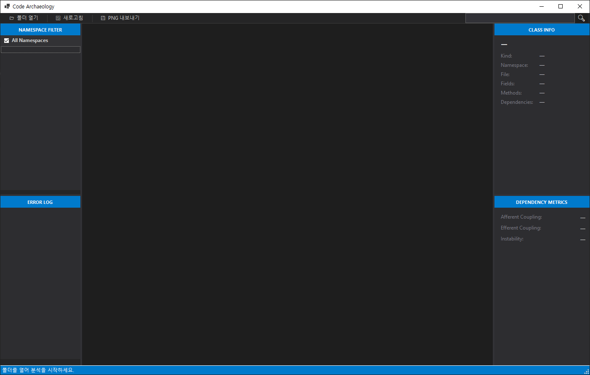
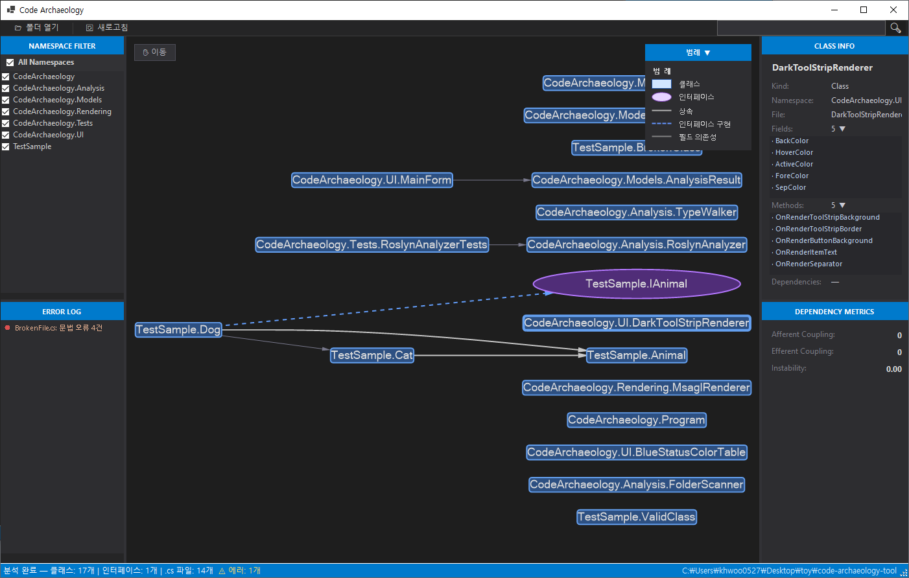

# Code Archaeology

[](https://github.com/khwoo0527/code-archaeology-tool/actions/workflows/ci.yml)
[](https://github.com/khwoo0527/code-archaeology-tool/releases/latest)

> C# 프로젝트 폴더를 열면 Roslyn으로 클래스 구조와 의존성을 자동 분석하고,
> Microsoft.Msagl 인터랙티브 그래프로 시각화하는 WinForms 데스크톱 도구

---

## 스크린샷

### 메인 화면 — 다크 테마 + 계층형 그래프 + 3분할 레이아웃



### 의존성 그래프 — 상속/인터페이스/필드 엣지 색상 구분 + 범례 패널



> 스크린샷 폴더: `docs/screenshots/`

---

## 현재 상태

| 항목 | 내용 |
|------|------|
| Sprint 1 | ✅ 완료 — Core 12개 + Extension 7개 |
| Sprint 2 | ✅ 완료 — 3분할 레이아웃 + 인터랙션 + Extension 4개 |
| Sprint 3 | ✅ 완료 — 영향 분석 + 코드 스멜 지표 + UX 버그픽스 |
| CI/CD | ✅ GitHub Actions — 빌드 + 단위 테스트 + 아티팩트 업로드 |
| 단위 테스트 | ✅ 21개 전원 통과 (RoslynAnalyzer / CycleDetector / struct·record·enum) |

---

## 주요 기능

### 분석 엔진

| 기능 | 설명 |
|------|------|
| **폴더 열기** | C# 프로젝트 폴더 선택 → 자동 분석 (3클릭 이내) |
| **의존성 분석** | 클래스 상속 / 인터페이스 구현 / 필드 타입 의존성 추출 |
| **타입 지원** | class / interface / struct / record / enum 모두 인식 |
| **partial class 병합** | 동일 FullName 노드 자동 통합, 필드/메서드 수 합산 |
| **순환 의존성 감지** | DFS back-edge 탐지 — 순환 노드/엣지 빨간색 강조 |
| **비동기 분석** | `Task.Run()` 기반 — 대규모 프로젝트에서도 UI 프리징 없음 |
| **에러 처리** | 파싱 실패 파일은 건너뛰고 Error Log에 기록 |

### 시각화

| 기능 | 설명 |
|------|------|
| **계층형 그래프** | Sugiyama TB 레이아웃 — 클래스 계층 구조를 위에서 아래로 표시 |
| **노드 모양 구분** | class(박스) / interface(타원) / struct(다이아몬드) / record(둥근박스) / enum(헥사곤) |
| **엣지 색상 구분** | 상속(회색 실선) / 인터페이스(파랑 점선) / 필드 의존성(중간 회색) |
| **다크 테마** | DarkToolStripRenderer + 파란 StatusBar — 모던 IDE 감성 |
| **범례 패널** | 우상단 오버레이 — 접기/펼치기 토글 |

### 인터랙션

| 기능 | 설명 |
|------|------|
| **노드 클릭 포커스** | 클릭 노드 + 1-hop 이웃 강조, 나머지 dim |
| **Class Info 패널** | 클릭 시 이름/Kind/Namespace/파일/Fields/Methods 표시, 목록 펼치기 |
| **Dependency Metrics** | Ca(Afferent) / Ce(Efferent) / Instability(F2) 실시간 계산 |
| **네임스페이스 필터** | 체크박스로 특정 네임스페이스 노드 즉시 숨기기/복원 |
| **검색** | 툴바 검색창 — 이름/FullName 대소문자 무관 매칭, 비매칭 dim |
| **호버 툴팁** | 노드 위에 마우스 올리면 다크 테마 커스텀 툴팁 표시 |
| **팬 모드** | ✋ 이동 버튼 또는 스페이스바 누른 채 드래그 |
| **영향 분석** | 🔍 버튼 — 선택 노드를 직간접 참조하는 모든 클래스 역방향 BFS 탐색 |
| **코드 스멜** | 📊 버튼 — Ca 비례 노드 크기 확대, Instability 비례 파랑→빨강 색상 |
| **PNG 내보내기** | 💾 버튼 — 범례 포함 현재 화면 전체 캡처 저장 |

---

## 시작하기

### 요구 사항

- Windows 10 이상
- [.NET 8 Runtime](https://dotnet.microsoft.com/download/dotnet/8.0)

### 다운로드 (빌드 없이 바로 실행)

**[최신 릴리스 다운로드 → v1.0.0](https://github.com/khwoo0527/code-archaeology-tool/releases/latest)**

`CodeArchaeology.exe` 다운로드 후 직접 실행 (Windows 10+, .NET 8 Runtime 필요)

### 빌드 및 실행

```bash
git clone https://github.com/khwoo0527/code-archaeology-tool.git
cd code-archaeology-tool
dotnet build CodeArchaeology/CodeArchaeology.csproj
dotnet run --project CodeArchaeology/CodeArchaeology.csproj
```

또는 Visual Studio 2022에서 `CodeArchaeology.sln` 열고 `F5`

### 테스트 실행

```bash
dotnet test CodeArchaeology.Tests --verbosity normal
```

---

## 사용 방법

1. 툴바 **📂 폴더 열기** → 분석할 C# 프로젝트 폴더 선택
2. 그래프 자동 렌더링 — StatusBar에서 분석 결과 요약 확인
3. **노드 클릭** → 우측 Class Info / Dependency Metrics 패널 확인
4. **🔍 영향 분석** → 해당 클래스를 참조하는 모든 클래스 하이라이트
5. **📊 코드 스멜** → 결합도·불안정성 시각화
6. **✋ 이동** 또는 스페이스바 드래그로 그래프 탐색
7. **💾 PNG 내보내기** → 현재 화면을 이미지로 저장

---

## 기술 스택

| 영역 | 기술 | 버전 |
|------|------|------|
| UI | WinForms (.NET 8) | net8.0-windows |
| 코드 분석 | Microsoft.CodeAnalysis.CSharp (Roslyn) | 5.3.0 |
| 그래프 렌더링 | Microsoft.Msagl + GraphViewerGdi | 1.1.6 / 1.1.7 |
| 단위 테스트 | xUnit | 2.9.3 |
| CI/CD | GitHub Actions | windows-latest / .NET 8 |

---

## 프로젝트 구조

```
CodeArchaeology/
├── Models/           ← TypeNode, DependencyEdge, AnalysisResult, TypeKind, EdgeType
├── Analysis/         ← FolderScanner, RoslynAnalyzer (SyntaxWalker), CycleDetector (DFS)
├── Rendering/        ← MsaglRenderer (Sugiyama 레이아웃, 다크 테마 색상)
├── UI/               ← MainForm, DarkToolStripRenderer
└── _TestSample/      ← 로컬 검증용 샘플 (class·interface·struct·record·enum·순환)

CodeArchaeology.Tests/
├── RoslynAnalyzerTests.cs   ← 11개 (노드·엣지·partial·에러 처리)
├── CycleDetectorTests.cs    ← 6개 (비순환·직접순환·3노드순환·혼합)
└── StructRecordEnumTests.cs ← 4개 (struct·record·enum·전체 타입)
```

---

## 아키텍처

```
UI (WinForms)  →  Analysis (Roslyn)  →  Models (Graph)
  MainForm          FolderScanner         TypeNode
                    RoslynAnalyzer        DependencyEdge
                    CycleDetector         AnalysisResult
              →  Rendering (Msagl)
                    MsaglRenderer
```

레이어 간 단방향 의존성 준수 — UI는 Analysis를 직접 호출하지 않고 AnalysisResult(Model)를 통해 데이터를 받는다. MsaglRenderer는 WinForms에 무관하게 AnalysisResult만 입력으로 받는다.

---

## 왜 Code Archaeology인가?

| 기존 도구 | 한계 |
|----------|------|
| VS 클래스 다이어그램 | 클래스를 수동으로 하나씩 추가해야 함 |
| NDepend / ReSharper | 유료, 팀 전체 도입 비용 발생 |
| Graphviz | DOT 언어를 직접 작성해야 함 |
| UML 도구 | 코드와 다이어그램이 따로 관리되어 항상 불일치 |

**Code Archaeology**: 폴더 선택 한 번 → 로컬 실행 → 항상 현재 코드 기준 자동 분석

---

## 로드맵

| Sprint | 상태 | 목표 |
|--------|------|------|
| Sprint 1 | ✅ 완료 | 폴더 열기 → 의존성 분석 → 다크 테마 그래프 |
| Sprint 2 | ✅ 완료 | 3분할 레이아웃 + 노드 클릭 Class Info + 네임스페이스 필터 + 인터랙션 |
| Sprint 3 | ✅ 완료 | 영향 분석 + 코드 스멜 지표 + struct/record/enum + UX 버그픽스 |
| Sprint 4 | 예정 | 회귀 테스트 + 릴리스 준비 |

자세한 내용은 [ROADMAP.md](./ROADMAP.md) 참조

---

## 문서

- [PRD.md](./PRD.md) — 제품 요구사항 정의서
- [ROADMAP.md](./ROADMAP.md) — 전체 개발 로드맵
- [docs/sprints/sprint-1.md](./docs/sprints/sprint-1.md) — Sprint 1 진행 기록
- [docs/sprints/sprint-2.md](./docs/sprints/sprint-2.md) — Sprint 2 진행 기록
- [docs/sprints/sprint-3.md](./docs/sprints/sprint-3.md) — Sprint 3 진행 기록

---

## 라이선스

MIT
